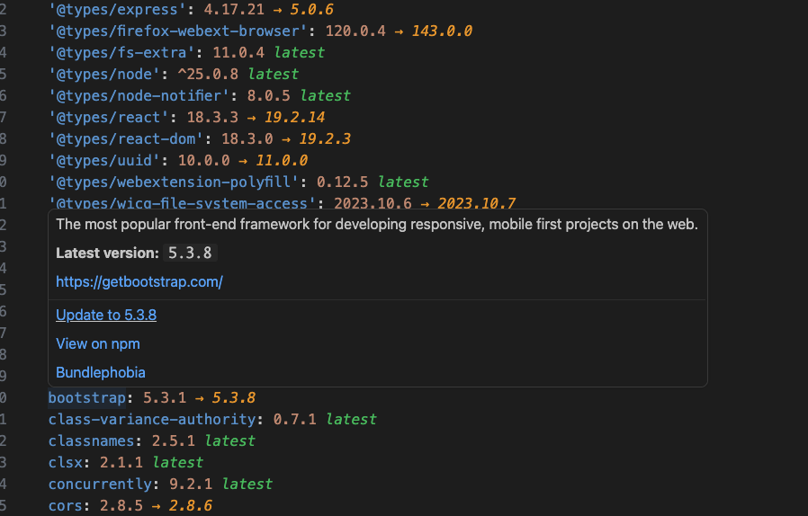

# pnpm-catalog-manager

A Visual Studio Code extension for managing dependencies in pnpm workspace catalogs. It provides inline version information, update notifications, and quick actions for packages defined in your `pnpm-workspace.yaml` file.

## Features



### Inline Version Decorations

When you open a `pnpm-workspace.yaml` file, the extension displays inline decorations next to each package in your `catalog:` and `catalogs:` sections:

- **Outdated packages** show the latest available version in orange (e.g., `-> 2.0.0`)
- **Up-to-date packages** show `latest` in green

### Hover Information

Hovering over any package line displays detailed information fetched from the npm registry:

- Package description
- Latest version available
- Homepage URL
- Links to view the package on npm and Bundlephobia

### One-Click Updates

When a package has a newer version available, the hover tooltip includes an "Update to X.X.X" link. Clicking this will:

1. Update the version in your `pnpm-workspace.yaml` file
2. Save the file
3. Run `pnpm install` to apply the changes

## Supported Catalog Formats

The extension supports both catalog formats in `pnpm-workspace.yaml`:

**Default catalog:**
```yaml
catalog:
  react: 18.3.1
  typescript: 5.0.0
```

**Named catalogs:**
```yaml
catalogs:
  react18:
    react: 18.3.1
    react-dom: 18.3.1
  react19:
    react: 19.0.0
    react-dom: 19.0.0
```

## Commands

Open the Command Palette (`Cmd+Shift+P` on macOS, `Ctrl+Shift+P` on Windows/Linux) and search for:

| Command | Description |
|---------|-------------|
| `PNPM Catalog: Refresh Outdated Packages` | Manually refresh the outdated packages cache. Use this after making changes outside of VS Code or to force a fresh check. |
| `PNPM Catalog: Update Package to Latest` | Update a specific package to its latest version. This command is typically invoked via the hover tooltip. |

## Requirements

- **pnpm** must be installed and available in your PATH
- A valid `pnpm-workspace.yaml` file in your workspace

## How It Works

1. When you open a `pnpm-workspace.yaml` file, the extension runs `pnpm outdated -r --json` to fetch outdated package information
2. Results are cached per workspace to avoid repeated calls
3. Hover information is fetched on-demand from the npm registry and cached for performance
4. The cache is automatically refreshed when you switch workspaces

## Known Issues

- The extension relies on `pnpm outdated` which requires packages to be installed. If you have a fresh workspace without `node_modules`, run `pnpm install` first.
- Version decorations may take a moment to appear on first load while the outdated check runs.

## Release Notes

### 0.0.1

Initial release with the following features:
- Inline version decorations for catalog packages
- Hover tooltips with package information from npm
- One-click update to latest version
- Support for both `catalog:` and named `catalogs:` sections
